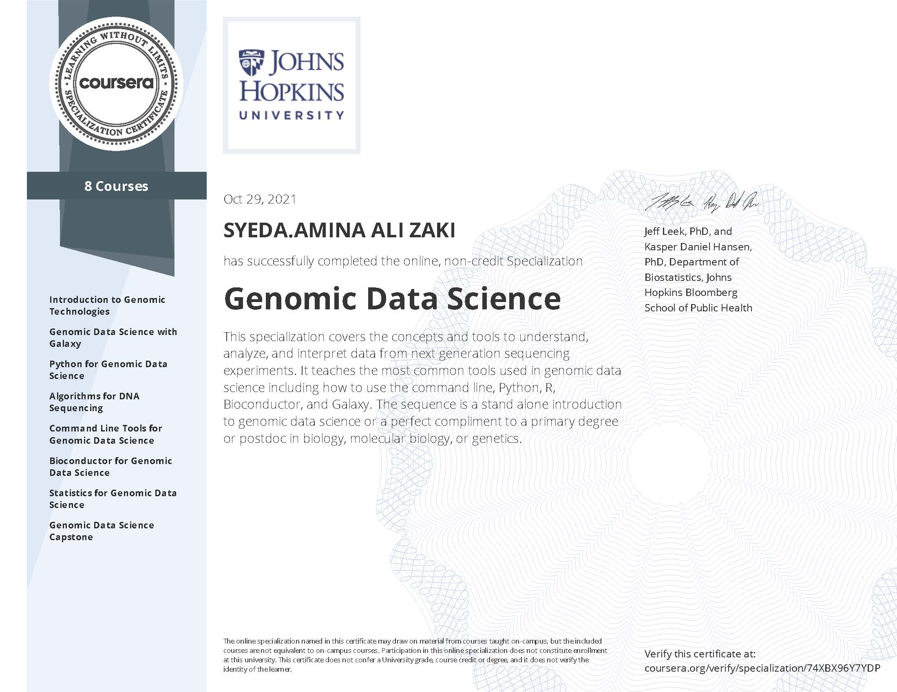

# Genomic-Data-Science-Specialization

# Specialization Certificate

# Specialization Certificate from Johns Hopkins University Coursera (8 courses)

With genomics sparks a revolution in medical discoveries, it becomes imperative to be able to better understand the genome, and be able to leverage the data and information from genomic datasets. Genomic Data Science is the field that applies statistics and data science to the genome. 

This Specialization covers the concepts and tools to understand, analyze, and interpret data from next generation sequencing experiments. It teaches the most common tools used in genomic data science including how to use the command line, along with a variety of software implementation tools like Python, R, and Bioconductor. 

This Specialization is designed to serve as both a standalone introduction to genomic data science or as a perfect compliment to a primary degree or postdoc in biology, molecular biology, or genetics, for scientists in these fields seeking to gain familiarity in data science and statistical tools to better interact with the data in their everyday work.

# List of Courses
## Course 1: Introduction to Genomic Technologies
## Course 2: Python for Genomic Data Science
## Course 3: Genomic Data Science with Galaxy
## Course 4: Algorithms for DNA Sequencing
## Course 5: Command Line Tools for Genomic Data Science
## Course 6: Bioconductor for Genomic Data Science
## Course 7: Statistics for Genomic Data Science
## Course 8: Genomic Data Science Capstone

